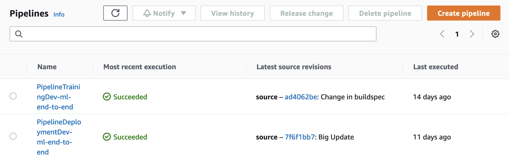
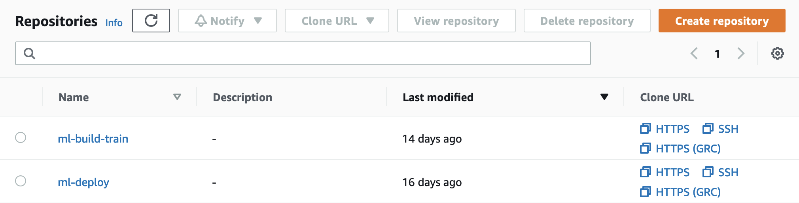
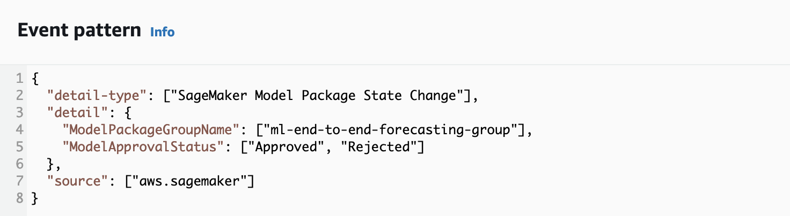

# SageMaker End to End lab for Building, Training, and Deploying ML models

In this repository, we are stepping through an end to end implementation of Machine Learning (ML) models using Amazon SageMaker,
by deploying versioned models stored in the Amazon SageMaker Model Registry for real-time inference using Amazon SageMaker Hosting Services.

This is a sample code repository for demonstrating how to organize your code for build and train your model, by starting from 
an implementation through notebooks for arriving to a code structure architecture for implementing ML pipeline using Amazon 
SageMaker Pipeline, and how to setup a repository for deploying ML models using CI/CD.

This repository is enriched by CloudFormation templates for setting up the ML environment, by creating the SageMaker Studio 
environment, Networking, and CI/CD for deploying ML models.

Everything can be tested by using the example notebooks for running training on SageMaker using the following frameworks:
* [TensorFlow](https://www.tensorflow.org/)
* [Huggingface - Amazon Bort](https://huggingface.co/amazon/bort)

## Machine Learning Task

In this example, we are performing a Sentiment Analysis task by creating a multiclass classification model using 
[Huggingface - Amazon Bort](https://huggingface.co/amazon/bort) and training on a dataset of Negative, Neutral, Positive tweets.

* Negative - 0
* Neutral - 1
* Positive - 2

## Content overview

In this repository, you will cover an end-to-end approach for building, training, deploying, and monitoring a ML model for 
fraud detection by using Amazon SageMaker.

1. *Data Visualization* using [Amazon SageMaker Studio Notebooks](https://docs.aws.amazon.com/sagemaker/latest/dg/notebooks.html)
2. *Data Preparation* for training using [Amazon SageMaker Processing](https://docs.aws.amazon.com/sagemaker/latest/dg/processing-job.html), 
by exploring the different capabilities that Amazon SageMaker is providing us:
   1. [Framework Processor](https://sagemaker.readthedocs.io/en/stable/api/training/processing.html) Use the Amazon SageMaker framework containers by providing your own
   custom python scripts and python dependencies using a requirements.txt
   2. [Custom Scripts Container](https://docs.aws.amazon.com/sagemaker/latest/dg/processing-container-run-scripts.html) Build your own custom container that has your python dependencies
   installed and provide your own custom python scripts
   3. [BYOC](https://docs.aws.amazon.com/sagemaker/latest/dg/build-your-own-processing-container.html) Build your own custom container that has your own code and dependencies
3. *Store dataset features* by using [Amazon SageMaker Feature Store](https://docs.aws.amazon.com/sagemaker/latest/dg/feature-store-getting-started.html)
4. *Train, and version ML models* using [Amazon SageMaker Training](https://docs.aws.amazon.com/sagemaker/latest/dg/how-it-works-training.html), 
by exploring the different capabilities that Amazon SageMaker is providing us, and [Amazon SageMaker Model Registry](https://docs.aws.amazon.com/sagemaker/latest/dg/model-registry.html):
   1. [Framework Container](https://docs.aws.amazon.com/sagemaker/latest/dg/docker-containers-prebuilt.html) Use the Amazon SageMaker framework containers by providing your own
   custom python scripts and python dependencies using a requirements.txt
   2. [Custom Scripts Container](https://docs.aws.amazon.com/sagemaker/latest/dg/docker-containers-adapt-your-own.html) Adapt your own custom container that has your python dependencies installed 
   by using the [Amazon SageMaker Training Toolkit](https://github.com/aws/sagemaker-training-toolkit) and provide your own custom python scripts
   3. [BYOC](https://docs.aws.amazon.com/sagemaker/latest/dg/your-algorithms-training-algo.html) by building your own custom container that has your own code and dependencies
5. *Hyperparameters optimization* by using [Amazon SageMaker Hyperparameter Tuning](https://docs.aws.amazon.com/sagemaker/latest/dg/automatic-model-tuning.html)
6. *ML workflow Pipeline* creation, by using Processing, Training, and Versioning steps, by using [Amazon SageMaker Pipeline](https://docs.aws.amazon.com/sagemaker/latest/dg/pipelines.html)
7. *Real-Time endpoint* deployment using [Amazon SageMaker Hosting Services](https://docs.aws.amazon.com/sagemaker/latest/dg/how-it-works-deployment.html), 
by exploring the different capabilities that Amazon SageMaker is providing us:
   1. [Framework Predictor](https://sagemaker.readthedocs.io/en/stable/frameworks/index.html) Provide your own inference script and deploy an ML model, taken from the Amazon SageMaker Model Registry,
   by using the Amazon SageMaker framework container
   2. [BYOC](https://docs.aws.amazon.com/sagemaker/latest/dg/your-algorithms-inference-main.html) Build your own custom container that has your own code and dependencies, and expose the necessary endopoints
   for Amazon SageMaker Real-Time Endpoint
8. *Feature attributions* computation for model explainability by using [Amazon SageMaker Clarify](https://docs.aws.amazon.com/sagemaker/latest/dg/clarify-configure-processing-jobs.html) 
9. *Monitor model quality* by using [Amazon SageMaker Model Monitoring](https://docs.aws.amazon.com/sagemaker/latest/dg/model-monitor-model-quality.html) with the possibility to execute
*Model Quality jobs manually* for testing batch executions

## 1. Machine Learning End to End with Amazon SageMaker

### Environment Setup

Setup the ML environment by deploying the [CloudFormation](./infrastructure_templates) templates described as below:

1. [00-networking](./infrastructure_cloudformation/00-networking/template.yml): This template is creating a networking resources,  
such as VPC, Private Subnets, Security Groups, for a secure environment for Amazon SageMaker Studio. The necessary variables 
used by SageMaker Studio are stored using [AWS Systems Manager](https://docs.aws.amazon.com/systems-manager/latest/userguide/what-is-systems-manager.html)
2. [01-sagemaker-studio](./infrastructure_cloudformation/01-sagemaker-studio-environment/template.yml): This template is creating 
the SageMaker Studio environment, with the necessary execution role used during the experimentation and the execution of the 
SageMaker Jobs. *Parameters*:
   1. *SageMakerDomainName*: Name to assign to the Amazon SageMaker Studio Domain. *Mandatory* 
   2. *SecurityGroupId*: Provide a Security Group for studio if you want to use your own networking setup, otherwise the parameter
   is read by using AWS SSM after the deployment of the template [00-networking](./infrastructure_templates/00-networking/template.yml). *Optional*
   3. *SubnetId*: Provide a Subnet (Public or Private) for studio if you want to use your own networking setup, otherwise the parameter
   is read by using AWS SSM after the deployment of the template [00-networking](./infrastructure_templates/00-networking/template). *Optional*
   4. *VpcId*: Provide a Vpc ID for studio if you want to use your own networking setup, otherwise the parameter is read by 
   using AWS SSM after the deployment of the template [00-networking](./infrastructure_templates/00-networking/template). *Optional*
3. [02-ml-environment](./infrastructure_cloudformation/02-ml-environment/template.yml): This template is creating the necessary resources for the 
ML environment, such as Amazon S3 bucket for storing code and model artifacts, and Amazon SageMaker Model Registry for versioning 
trained ML models.
*Parameters*:
   1. KMSAlias: Alias to use for the KMS Key for encrypting data. *Optional*
   2. ModelPackageGroupName: Name of the Amazon SageMaker Model Package Group where ML models will be stored. *Mandatory*
   3. S3BucketName: Name for the S3 bucket where ML model artifacts, code artifacts, and data will be stored. *Mandatory*

### Labs

#### 1. Prepare data, train ML models using Amazon SageMaker

Explore the directory [00-ml-build-train](./seed_code/00-ml-build-train)

The code structure defined for the [Build and Train ML models](seed_code/00-model-build-train) is the following:

* [algorithms](seed_code/00-ml-build-train/algorithms): The code used by the ML pipelines for processing and training ML models is stored in this folder
  * [algorithms/processing](seed_code/00-ml-build-train/algorithms/processing): This folder contains the python code for performing processing of data
  using Amazon SageMaker Processing Jobs
  * [algorithms/training](seed_code/00-ml-build-train/algorithms/training): This folder contains the python code for training a custom ML model 
  using Amazon SageMaker Training Jobs
* [mlpipelines](seed_code/00-ml-build-train/mlpipelines): This folder contains some utilities scripts created in the official AWS example 
[Amazon SageMaker secure MLOps](https://github.com/aws-samples/amazon-sagemaker-secure-mlops) and it contains the definition for the 
Amazon SageMaker Pipeline used for training
  * [mlpipelines](seed_code/00-ml-build-train/mlpipelines/training): This folder contains the python code for the ML pipelines used for training
* [notebooks](seed_code/00-model-build-train/notebooks): This folder contains the lab notebooks to use for this workshop:
  * [notebooks/00-Data-Visualization](seed_code/00-ml-build-train/notebooks/00-Data-Visualization.ipynb): Explore the input data and test the processing scripts 
  in the notebook
  * [notebooks/01-Prepare-Data-ML-Framework-Container](seed_code/00-ml-build-train/notebooks/01-Prepare-Data-ML-Framework-Container.ipynb): Define a Python Script and create jobs for data processing using 
  Amazon SageMaker Processing
  * [notebooks/02-Prepare-Data-ML-Custom-Script-Container](seed_code/00-ml-build-train/notebooks/02-Prepare-Data-ML-Custom-Script-Container.ipynb): Create jobs for data processing using 
  Amazon SageMaker Processing with a Custom Container by providing a Custom Script
  * [notebooks/03-Prepare-Data-ML-Custom-Container](seed_code/00-ml-build-train/notebooks/03-Prepare-Data-ML-Custom-Container.ipynb): Create jobs for data processing using 
  Amazon SageMaker Processing with by using a Custom Container (*BYOC*)
  * [notebooks/04-Store-Features](seed_code/00-ml-build-train/notebooks/04-Store-Features.ipynb): Store features from prepared data using 
  Amazon SageMaker Feature Store
  * [notebooks/05-Training-Build-Model-Framework-Container](seed_code/00-ml-build-train/notebooks/05-Train-Build-Model-Framework-Container.ipynb): Train a ML model using SageMaker Training, Register 
  the trained model version by using Amazon SageMaker Model Registry.
  * [notebooks/06-Train-Build-Model-Custom-Script-Containerl](seed_code/00-ml-build-train/notebooks/06-Train-Build-Model-Custom-Script-Container.ipynb): 
  Train a ML model using SageMaker Training with a *Custom Container* by providing *Custom Scripts*, and Register the trained model version by using Amazon SageMaker Model Registry.
  * [notebooks/07-Train-Build-Model-Custom-Container](seed_code/00-ml-build-train/notebooks/07-Train-Build-Model-Custom-Container.ipynb): 
  Train a ML model using SageMaker Training by using a Custom Container (*BYOC*), and Register the trained model version by using Amazon SageMaker Model Registry.
  * [notebooks/08-Hyperparameter-Optimization](seed_code/00-ml-build-train/notebooks/08-Hyperparameter-Optimization.ipynb): Identify 
  the best configuration set of hyperparameters for your ML algorithm by using Amazon SageMaker Hyperparameter Optimization 
  * [notebooks/09-SageMaker-Pipeline-Training](seed_code/00-ml-build-train/notebooks/09-SageMaker-Pipeline-Training.ipynb): Define 
  the workflow steps and test the entire end to end using Amazon SageMaker Pipeline


#### 2. Evaluate, Deploy ML models with Real-Time endpoint, and Monitor ML model quality

Explore the directory [01-ml-deploy](./seed_code/01-ml-deploy)

The code structure defined for the [Deploy ML models](seed_code/01-ml-deploy) is the following:

* [algorithms](seed_code/01-ml-deploy/algorithms): The code used by Amazon SageMaker Endpoint for performing inference is stored in this folder
  * [algorithms/inference](seed_code/01-ml-deploy/algorithms/inference): This folder contains the python code for performing inference 
  using Amazon SageMaker Endpoints.
  * [algorithms/inference-custom-container](seed_code/01-ml-deploy/algorithms/inference-custom-container): This folder contains the python code for performing inference 
  using Amazon SageMaker Endpoints. It contains the code structure for creating an application server, the Dockerfile for creating an Image to be used with 
  Amazon SageMaker Hosting.
* [mlpipelines](seed_code/01-ml-deploy/mlpipelines): This folder contains some utilities scripts created in the official AWS example
[Amazon SageMaker secure MLOps](https://github.com/aws-samples/amazon-sagemaker-secure-mlops) and it contains the scripts to run 
through CI/CD for creating or updating Amazon SageMaker Endpoints
* [notebooks](seed_code/01-ml-deploy/notebooks): This folder contains the lab notebooks to use for this workshop:
  * [notebooks/00-SageMaker-Endpoint](seed_code/01-ml-deploy/notebooks/00-Deploy-SageMaker-Endpoint.ipynb): This notebook shows you how to 
  deploy a trained ML model taken from the Amazon SageMaker Model Registry
  * [notebooks/01-SageMaker-Endpoint-Custom-Container](seed_code/01-ml-deploy/notebooks/01-Deploy-SageMaker-Endpoint-Custom-Container.ipynb): 
  This notebook shows you how to deploy a trained ML model taken from the Amazon SageMaker Model Registry by using a Custom Docker Image for 
  a Real-Time inference (BYOC)
  * [notebooks/02-Model-Monitor](seed_code/01-ml-deploy/notebooks/03-Model-Monitor.ipynb): Analyze feature importance in your deployed model 
  by using [Amazon SageMaker Clarify](https://docs.aws.amazon.com/sagemaker/latest/dg/clarify-configure-processing-jobs.html)
  * [notebooks/03-Model-Monitor](seed_code/01-ml-deploy/notebooks/03-Model-Monitor.ipynb): This notebook shows you how to 
  create Amazon SageMaker Model Monitor jobs for monitoring model quality on the deployed endpoint
  * [notebooks/04-Pipeline-Deployment](seed_code/01-ml-deploy/notebooks/04-Pipeline-Deployment.ipynb): Define 
  the workflow steps and test the entire end to end using the script for CI/CD deployment

## 2. Automate model deployments with AWS MLOps

### Environment Setup

Setup the ML environment by deploying the [CloudFormation](./infrastructure_templates) templates described as below:

1. [03-ci-cd](./infrastructure_cloudformation/03-ci-cd/template.yml): This template is creating the CI/CD pipelines using 
[AWS CodeBuild](https://docs.aws.amazon.com/codebuild/latest/userguide/welcome.html) and [AWS CodePipeline](https://docs.aws.amazon.com/codepipeline/latest/userguide/welcome.html).
It creates two CI/CD pipelines, linked to two AWS CodeCommit repositories, one for training and one for deployment, that can 
be triggered through pushes on the main branch or with the automation part deployed by using [Amazon EventBridge Rule](https://docs.aws.amazon.com/eventbridge/latest/userguide/eb-rules.html), 
for monitoring updates in the SageMaker Model Registry and start the CI/CD pipeline for deploying ML models in the production environments.
*Parameters*:
   2. *PipelineSuffix*: Suffix to use for creating the CI/CD pipelines. *Optional*
   3. *RepositoryTrainingName*: Name for the repository where the build and train code will be stored. *Optional*
   4. *RepositoryDeploymentName*:  Name for the repository where the deployment code will be stored. *Optional*
   5. *S3BucketArtifacts*: Name of the Amazon S3 Bucket that will be created in the next stack used for storing code and model artifacts. *Mandatory*


The [CloudFormation templates](./infrastructure_templates) provided are creating a fully worked ML environment with CI/CD pipelines for automating the training 
of ML models and the deployment of real-time endpoints.

By starting from the AWS CodeCommit repositories created, you can customize the execution of CI/CD pipelines by editing the configurations 
for the repositories *ml-build-train* and *ml-deploy*.

Commits and Pushes in the two AWS CodeCommit repositories will automate the execution of the AWS CodePipeline for executing the training 
using the [Amazon SageMaker Pipeline](./seed_code/00-ml-build-train/mlpipelines/training/pipeline.py) and the [deployment](./seed_code/01-ml-deploy/mlpipelines/deployment/pipeline.py)
of a real-time endpoint.



### Labs

#### 1. Continuous training with AWS CodePipeline and Amazon SageMaker Pipeline

The previously deployed CloudFormation template created two AWS CodeCommit repositories:



By starting from the AWS CodeCommit repositories created, you can customize the execution of CI/CD pipelines by editing the configurations 
for the repositories *ml-build-train* and *ml-deploy*.

* Clone the repo *ml-build-train*
* Copy the content of [00-ml-build-train](./seed_code/00-ml-build-train) inside the created folder
* Edit the YAML configuration file.

Example:
```
training:
    pipeline_name: MLOpsTrainPipeline
    region: eu-west-1
    role: # Execution role name for SageMaker
    kms_account_id: # AWS Account ID where the KMS key was created
    kms_alias: ml-kms
    bucket_name: # Amazon S3 Bucket where ML models will be stored
    inference_instance_type: ml.m5.xlarge
    model_package_group_name: ml-end-to-end-group
    processing_artifact_path: artifact/processing
    processing_artifact_name: sourcedir.tar.gz
    processing_framework_version: 0.23-1
    processing_instance_count: 1
    processing_instance_type: ml.t3.large
    processing_input_files_path: data/input
    processing_output_files_path: data/output
    training_artifact_path: artifact/training
    training_artifact_name: sourcedir.tar.gz
    training_output_files_path: models
    training_framework_version: 2.5
    training_python_version: py37
    training_instance_count: 1
    training_instance_type: ml.g4dn.xlarge
    training_hyperparameters:
        epochs: 6
        learning_rate: 1.45e-4
        batch_size: 100
```
* Commit and push changes in the repository

#### 2. Continuous deployment by using AWS CodePipeline, Amazon EventBridge, and Amazon SageMaker Model Registry

The previously deployed CloudFormation template created two AWS CodeCommit repositories:


By starting from the AWS CodeCommit repositories created, you can customize the execution of CI/CD pipelines by editing the configurations 
for the repositories *ml-build-train* and *ml-deploy*.

* Clone the repo *ml-deploy*
* Copy the content of [01-ml-deploy](./seed_code/01-ml-deploy) inside the created folder
* Edit the YAML configuration file.

Example:
```
deployment:
    pipeline_name: MLOpsDeploymentPipeline
    region: eu-west-1
    kms_account_id: # AWS Account ID where the KMS key was created
    kms_alias: ml-kms
    env: dev
    role:
    bucket_artifacts: # Amazon S3 Bucket where ML model artifacts are stored
    bucket_inference: # Amazon S3 Bucket for ML inference
    inference_artifact_path: artifact/inference
    inference_artifact_name: sourcedir.tar.gz
    inference_instance_count: 1
    inference_instance_type: ml.m5.xlarge
    model_package_group: ml-end-to-end-group
    monitoring_output_path: data/monitoring/captured
    training_framework_version: 2.5
```

For automating the deployment of a ML model, an Amazon EventBridge Rule for monitoring updates in the Amazon SageMaker Model Package group is created, 
by targeting the AWS CodePipeline for deployment.

